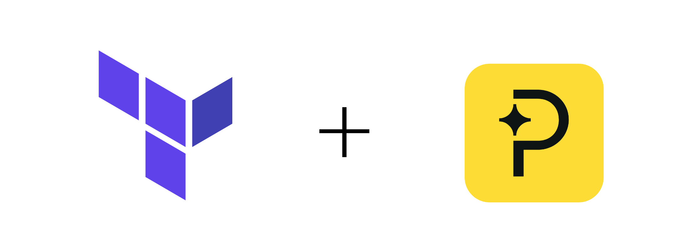

<br><br>

<p align="center">
  <a href="#">
    
    </a>
    <br><br><br>
    <h2 align="center">Terraform + Paddle &nbsp;</h2>
    <p align="center">
      A Terraform provider for managing <a href="https://www.paddle.com/">Paddle</a> Billing resources. This provider allows you to configure and manage products, prices, discounts, customers, and notification settings using Terraform.
      <br><br>
      <a href="https://github.com/HQarroum/terraform-provider-paddle/actions">
        
      </a>
      <a href="https://github.com/HQarroum/terraform-provider-paddle/actions">
        
      </a>
      <a href="https://opensource.org/licenses/MIT">
        
      </a>
    </p>
</p>
<br>

## Requirements

- [Terraform](https://www.terraform.io/downloads.html) >= 1.0
- [Go](https://golang.org/doc/install) >= 1.23 (to build the provider plugin)
- A [Paddle](https://www.paddle.com/) account with API access

## Install

### Terraform Registry

This provider is published to the [Terraform Registry](https://registry.terraform.io/). To use it, add the following to your Terraform configuration:

```hcl
terraform {
  required_providers {
    paddle = {
      source  = "HQarroum/paddle"
      version = "~> 0.1.0"
    }
  }
}

provider "paddle" {
  api_key     = var.paddle_api_key
  environment = "sandbox" # or "production"
}
```

## Authentication

The provider requires a Paddle API key.

```hcl
provider "paddle" {
  api_key     = "your-paddle-api-key"
  environment = "sandbox"
}
```

## Usage

### Create a Product

```hcl
resource "paddle_product" "my_product" {
  name         = "My SaaS Product"
  description  = "A great software product"
  image_url    = "https://example.com/product-image.png"

  custom_data = {
    internal_id = "prod-001"
  }
}
```

### Create a Price

```hcl
resource "paddle_price" "monthly_price" {
  product_id  = paddle_product.my_product.id
  name        = "Monthly Subscription"
  description = "Monthly billing"
  tax_mode    = "account_setting"

  unit_price = {
    amount        = "2900"
    currency_code = "USD"
  }

  billing_cycle = {
    interval  = "month"
    frequency = 1
  }

  trial_period = {
    interval  = "day"
    frequency = 14
  }
}
```

### Create a Customer

```hcl
resource "paddle_customer" "customer" {
  email  = "customer@example.com"
  name   = "John Doe"
  locale = "en"

  custom_data = {
    company = "Acme Corp"
  }
}
```

### Create a Discount

```hcl
resource "paddle_discount" "summer_sale" {
  description = "Summer Sale 2025"
  type        = "percentage"
  amount      = "20"
  code        = "SUMMER2025"

  restrict_to = [paddle_product.my_product.id]
}
```

### Configure Notification Settings

```hcl
resource "paddle_notification_setting" "webhook" {
  description              = "Production webhook endpoint"
  destination              = "https://api.example.com/paddle/webhook"
  active                   = true
  include_sensitive_fields = false

  subscribed_events = [
    "transaction.completed",
    "subscription.created",
    "subscription.updated",
    "customer.created"
  ]
}
```

## Supported Resources

- `paddle_product` - Manage Paddle products
- `paddle_price` - Manage prices for products
- `paddle_customer` - Manage customer records
- `paddle_discount` - Manage discount codes
- `paddle_notification_setting` - Configure webhook endpoints

## Supported Data Sources

- `paddle_product` - Read product information
- `paddle_price` - Read price information
- `paddle_customer` - Read customer information
- `paddle_discount` - Read discount information

## Development

### Building the Provider

```bash
# Install dependencies
make deps

# Build the provider
make build

# Install locally for testing
make install
```

### Code Quality

```bash
# Format code
make fmt

# Run linters
make lint

# Run go vet
make vet
```

## Support

- 🐛 [Report a Bug](https://github.com/HQarroum/terraform-provider-paddle/issues/new?labels=bug)
- 💡 [Request a Feature](https://github.com/HQarroum/terraform-provider-paddle/issues/new?labels=enhancement)
